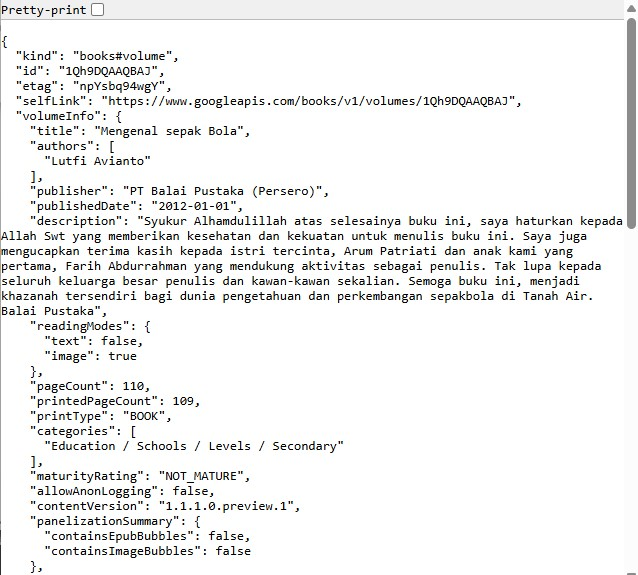
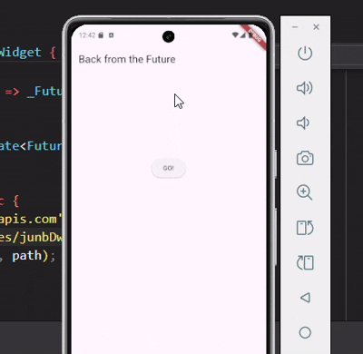
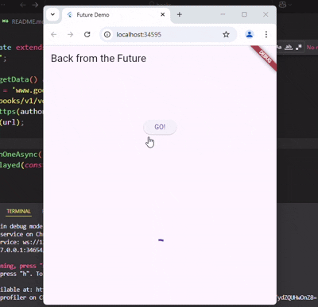
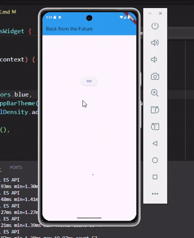
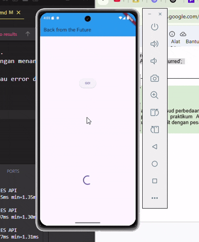

Asynchronous di Flutter

Praktikum 1
soal-1
sudah dimasukkan

soal-2

soal-3
substring(0, 450): Ambil 450 karakter pertama dari hasil data.
catchError: Kalau terjadi error saat ambil data, tampilkan pesan error di UI.

Praktikum 2
soal-1
langkah 1
Ketiga fungsi async ini menunggu selama 3 detik, lalu masing-masing mengembalikan angka 1, 2, dan 3.

langkah 2
Fungsi count() menjumlah hasil dari tiga fungsi async (1 + 2 + 3), lalu menampilkan totalnya ke UI lewat setState().

soal-2

Praktikum 3
soal-1
langkah 2
Fungsi getNumber() memulai proses async calculate(), lalu menunggu hasilnya lewat Completer. Setelah 5 detik, calculate() mengembalikan nilai 42.

soal-2

soal-3
Perbedaan
Langkah 2: Proses async dasar.
Langkah 5: Tambah keamanan dengan menangani error.
Langkah 6: Menangani hasil atau error dari proses async di UI.

soal-4

